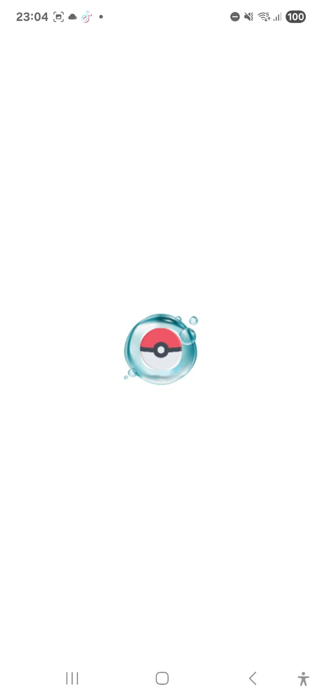
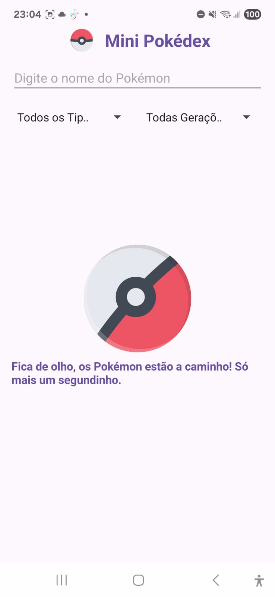
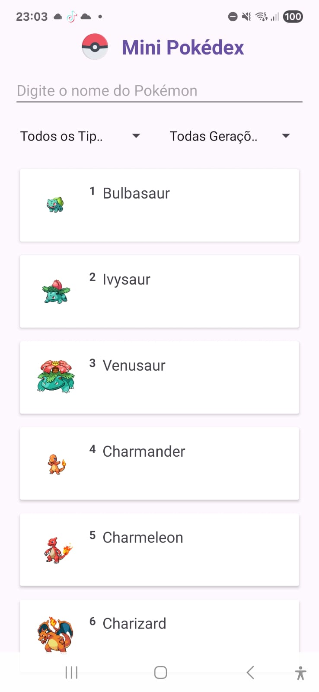
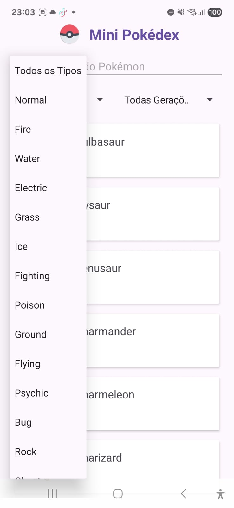
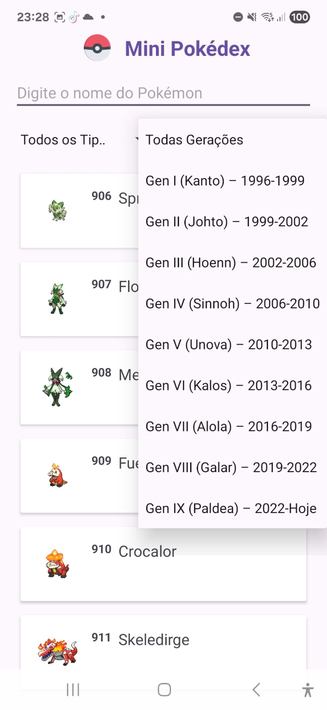
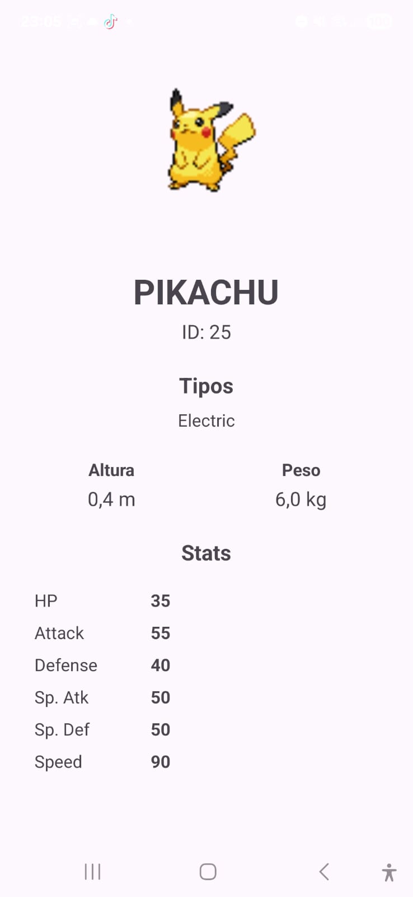

<p align="center">

<a href="README.en-US.md"></a>
<a href="README.zh-CN.md"></a>

</p>

---

# 🎮 Mini-Pokedex (Android Nativo com Kotlin)

Um aplicativo Pokédex para Android, desenvolvido em **Kotlin** como projeto final do curso **Venturus Native Android**. O projeto consome a **PokéAPI v2** pública e apresenta uma experiência fluida com telas de listagem, detalhes, busca e filtros avançados.

O projeto segue a arquitetura **MVVM** e implementa as melhores práticas do Jetpack, incluindo ViewModel, LiveData, DataBinding, SplashScreen API, além de Coroutines, Retrofit, Coil para carregamento de imagens e Lottie para animações.

---

## 🚀 Como Executar / Setup

### 📋 Pré-requisitos

- **Android Studio** (versão mais recente recomendada)
- **Android SDK** (compileSdk = 36, minSdk = 24)
- **Kotlin** 2.0.0 ou superior
- **Gradle** 8.x

### ⚙️ Passos de Instalação

#### 1️⃣ **Clone o repositório:**

```bash
git clone https://github.com/Andrehlb/mini-Pokedex.git
cd mini-Pokedex
```

#### 2️⃣ **Abra no Android Studio:**

- Abra o Android Studio
- Selecione **File > Open**
- Navegue até a pasta `mini-Pokedex` e clique em **Open**

#### 3️⃣ **Configure o Android SDK (se necessário):**

- Vá para **Tools > SDK Manager**
- Certifique-se de ter instalado:
    - **Android SDK Platform 36** (compileSdk)
    - **Android SDK Platform 24** (minSdk)
    - **Android Emulator** (ou conecte um dispositivo físico)

#### 4️⃣ **Build do Projeto:**

O Gradle fará download automático de todas as dependências.

```bash
./gradlew build
```

#### 5️⃣ **Rodando o App:**

- Conecte um emulador ou dispositivo físico
- Clique em **Run > Run 'app'** (Shift + F10)
- Ou via terminal:

```bash
./gradlew installDebug
```

### 🔗 Requisitos de Rede

O app requer **conexão com a internet** para consumir a **PokéAPI v2**:

- **Endpoint Base:** `https://pokeapi.co/api/v2/`
- **Permissão necessária:** `android.permission.INTERNET` (já adicionada no AndroidManifest.xml)

---

## ✅ Status Final do Projeto

**🏆 PROJETO 100% FUNCIONAL E COMPLETO!**

### Funcionalidades Implementadas:

| Funcionalidade | Status | Detalhes |
|---|---|---|
| **Splash Screen** | ✅ Completo | Tela inicial com animação |
| **RecyclerView** | ✅ Completo | Lista de 1.025 Pokémons |
| **Nome + Imagem** | ✅ Completo | Carregadas via Coil |
| **Busca por Nome** | ✅ Completo | Filtro em tempo real (EditText) |
| **Filtro por Tipo** | ✅ Completo | 18 tipos (Fire, Water, Grass, etc.) |
| **Filtro por Geração** | ✅ Completo | Gen I a Gen IX (Spinner) |
| **Tela de Detalhes** | ✅ Completo | Nome, ID, Imagem, Tipos, Altura, Peso |
| **Stats do Pokémon** | ✅ Completo | HP, Attack, Defense |
| **Integração de Filtros** | ✅ Completo | Funcionam juntos com a busca |
| **Compilação** | ✅ Sem Erros | Build bem-sucedido |

### 📊 Cobertura de Requisitos:

✅ **Splash Screen** - Criada e funcionando
✅ **Tela de Lista** - RecyclerView + busca + filtros duplos
✅ **Tela de Detalhes** - Todas as informações do Pokémon
✅ **Navegação** - Intent correta entre telas
✅ **API Integration** - 1.025 Pokémons carregados

---

## 📸 Screenshots / GIFs

### Tela de Splash


### Tela de Loading/Carregamento/Espera


### Tela de Lista com Busca


### Filtro de Tipos


### Filtro de Geração



### Tela de Detalhes


---

## Development Log - Sprints

### Sprint 1: Fundação e Estrutura Visual ✅ (Concluída)

- **Descrição:** Base do projeto, Splash Screen moderna, layouts Constraint/RecyclerView, navegação Intent
- **Conceitos:** Ciclo de vida Android, LayoutInflater, Intent
- **Artefatos:**
    - SplashActivity.kt
    - MainActivity.kt (layout base)
    - activity_main.xml
    - activity_splash.xml

### Sprint 2: Camada UI e Estado Reativo ✅ (Concluída)

- **Descrição:** MVVM com ViewModels, LiveData observers, RecyclerView com dados dinâmicos, coroutines para fetch da API
- **Conceitos:** Arquitetura MVVM, Lambda callbacks, LiveData observers
- **Artefatos:**
    - PokemonListViewModel.kt
    - DetailViewModel.kt
    - PokemonAdapter.kt
    - DataBinding em XMLs

### Sprint 3: Persistência, Animações e UI Avançada ✅ (Concluída)

- **Descrição:** Carregamento de 1.025 Pokémons, Lottie para animações de loading, filtros combinados (tipo + geração), busca integrada
- **Conceitos:** Lottie animations, Spinner widgets, TextWatcher para busca
- **Artefatos:**
    - activity_main.xml (spinners + EditText)
    - PokemonListViewModel.kt (lógica de filtros)
    - Lottie JSON animations

### Sprint 4: Camada de Dados e Rede ✅ (Concluída)

- **Descrição:** Retrofit PokeAPI, models de resposta JSON, coroutines para requisições assíncronas
- **Conceitos:** Retrofit + Gson, Coroutines, API REST
- **Artefatos:**
    - RetrofitClient.kt
    - PokeApiService.kt
    - PokemonResponse.kt
    - PokemonDetailResponse.kt

### Sprint 5: Polimento e Entrega ✅ (Concluída)

- **Descrição:** Refatoração de código, validação de erros, UX aprimorada, documentação
- **Conceitos:** Error handling, User feedback
- **Artefatos:**
    - BindingAdapters.kt (formatação de dados)
    - Toast/Loading indicators
    - README documentado

---

## 🛠 Tecnologias e Bibliotecas

### Core Android

- **Linguagem:** Kotlin 2.0.0
- **Arquitetura:** MVVM (Model-View-ViewModel)
- **Compilação:** Gradle Kotlin DSL

### Jetpack

- **ViewModel** - Gerenciamento de estado
- **LiveData** - Observação reativa de dados
- **DataBinding** - Binding entre layout XML e ViewModel
- **SplashScreen API** - Tela inicial nativa do Android 12+
- **RecyclerView** - Listagem eficiente
- **Constraint Layout** - Layouts responsivos

### Rede e API

- **Retrofit 2.11.0** - Cliente HTTP
- **Gson** - Serialização/Desserialização JSON
- **Coil 2.7.0** - Carregamento de imagens

### Assincronicidade

- **Coroutines 1.8.1** - Programação assíncrona
- **viewModelScope** - Escopo de coroutine para ViewModel

### Animações

- **Lottie 6.4.0** - Animações vetoriais

### Testes

- **JUnit 4** - Testes unitários
- **Espresso** - Testes de UI

---

## 📁 Estrutura de Pastas

```
app/src/main/
├── java/br/com/venturus/andrehlb/minipokedex/
│   ├── MainActivity.kt                    # Tela principal com lista
│   ├── DetailActivity.kt                  # Tela de detalhes
│   ├── SplashActivity.kt                  # Tela de splash
│   ├── PokemonAdapter.kt                  # Adapter RecyclerView
│   ├── model/
│   │   ├── Pokemon.kt                     # Modelo Pokemon
│   │   ├── PokemonResponse.kt             # Resposta API list
│   │   └── PokemonDetailResponse.kt       # Resposta API detail
│   ├── viewmodel/
│   │   ├── PokemonListViewModel.kt        # ViewModel lista
│   │   └── DetailViewModel.kt             # ViewModel detalhes
│   ├── network/
│   │   ├── PokeApiService.kt              # Interface Retrofit
│   │   └── RetrofitClient.kt              # Configuração Retrofit
│   ├── utils/
│   │   └── BindingAdapters.kt             # Data Binding adapters
│   └── adapter/
│       └── PokemonDiffCallback.kt         # DiffUtil callback
├── res/
│   ├── layout/
│   │   ├── activity_main.xml              # Layout principal
│   │   ├── activity_detail.xml            # Layout detalhes
│   │   ├── activity_splash.xml            # Layout splash
│   │   └── item_pokemon.xml               # Layout item RecyclerView
│   ├── drawable/
│   │   ├── ic_pokemon_placeholder.xml     # Placeholder image
│   │   └── ic_error.xml                   # Error image
│   ├── anim/
│   │   └── splash_animation.json          # Lottie animation
│   └── values/
│       ├── strings.xml                    # Strings app
│       └── colors.xml                     # Cores app
└── AndroidManifest.xml                    # Manifest
```

---

## 🔧 Configuração de Dependências

As dependências estão definidas em `app/build.gradle.kts`:

```gradle
// Jetpack
implementation("androidx.core:core-ktx:1.13.1")
implementation("androidx.appcompat:appcompat:1.7.0")
implementation("androidx.constraintlayout:constraintlayout:2.1.4")
implementation("androidx.recyclerview:recyclerview:1.3.2")

// ViewModel & LiveData
implementation("androidx.lifecycle:lifecycle-viewmodel-ktx:2.8.6")
implementation("androidx.lifecycle:lifecycle-livedata-ktx:2.8.6")

// DataBinding
implementation("androidx.databinding:databinding-runtime:8.5.0")

// SplashScreen
implementation("androidx.core:core-splashscreen:1.0.1")

// Retrofit & Gson
implementation("com.squareup.retrofit2:retrofit:2.11.0")
implementation("com.squareup.retrofit2:converter-gson:2.11.0")

// Coroutines
implementation("org.jetbrains.kotlinx:kotlinx-coroutines-android:1.8.1")

// Coil (Image Loading)
implementation("io.coil-kt:coil:2.7.0")

// Lottie
implementation("com.airbnb.android:lottie:6.4.0")
```

---

## 🐛 Troubleshooting

### Erro: "compileSdk = 36 é muito novo"

**Solução:** Atualize o Android SDK para a versão 36:
```bash
Tools > SDK Manager > Android 15 (API 36)
```

### Erro: "Cannot find symbol: PokeApiService"

**Solução:** Execute `Build > Clean Project` e depois `Build > Rebuild Project`

### Imagens não carregam

**Verificar:**
1. Conexão de internet está ativa?
2. URL da imagem está correta em `Pokemon.kt`?
3. Permissão `INTERNET` está no `AndroidManifest.xml`?

### App fecha ao filtrar

**Verificar:**
1. Spinner value não é nula?
2. `applyFilters()` está tratando exceções?

---

## 📚 Referências e Links

- **PokeAPI v2 Documentation:** https://pokeapi.co/docs/v2
- **Android Developers:** https://developer.android.com
- **Kotlin Documentation:** https://kotlinlang.org/docs
- **Jetpack Components:** https://developer.android.com/jetpack
- **Retrofit Documentation:** https://square.github.io/retrofit/

---

## 🙏 Agradecimentos

- **Felipe Dapolo, Vinicius Silva, Steffeson Wesley Lira** - Professores e mentores da trilha Venturus Native Android
- **Jéssica V. Dos S. Albertin, Maressa P. C. P. Ramalho, Raíssa Mayara da Silva** -  da equipe de **Desenvolvimento Humano**, pelo suporte, atenção e cuidado ao longo dessa jornada. 
- **Venturus** - Pela oportunidade e estrutura do curso
- **Google** - Pelo Android SDK e Jetpack
- **Square** - Pelo Retrofit
- **Airbnb** - Pelo Lottie
- **PokeAPI Community** - Pela API pública do Pokémon

---

## 📄 Licença

Este projeto é fornecido como parte do curso Venturus Native Android. Uso educacional é permitido.

---

**Desenvolvido com ❤️ por André Luiz Brbosa (Andrehlb)**  
**Última atualização:** 09 de Novembro de 2025
